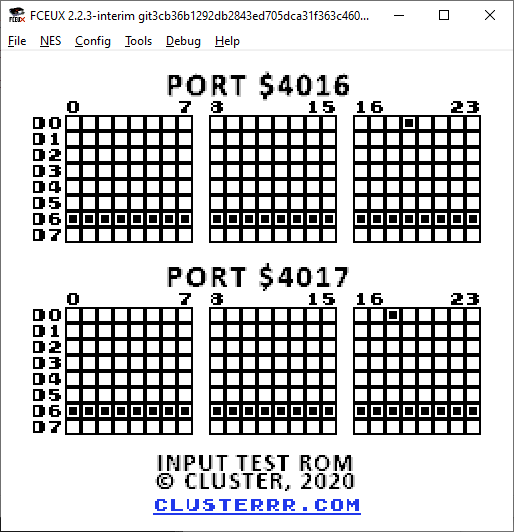
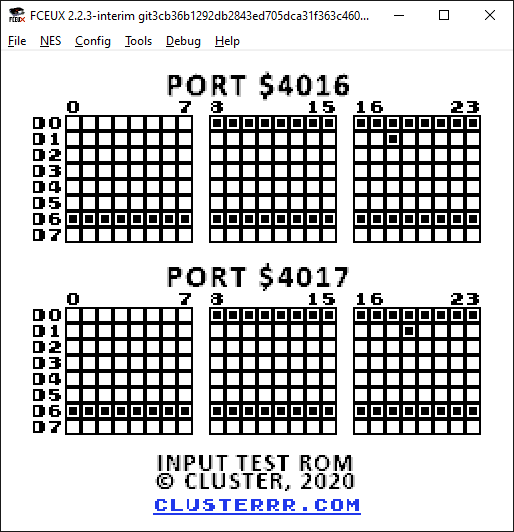

# ROM для проверки устройств ввода для NES
Это простой ROM для NES/Famicom что бы тестировать различные устройства ввода.

После стандартного сигнала сброса счетчиков на $4016.0 он читает $4016.0 – $4016.7 и $4017.0 – $4017.7 (да, все 8 линий данных, включая не подключенные на большинстве консолей) 24 раза (да, не только 8 раз). Таким образом, вы можете тестировать и реверс-инжинирить практически любое устройство ввода. Этот ROM оптимизирован для обновления данных о всех 384 битах за кадр.

## Пример
NES Four Score:

Вы можете увидеть подпись в третьем байте на $4016.0 и $4017.0 и нажатые кнопки на первых двух байтах.

Hori 4-Players Adapter:

То же самое, но с использованием линии D1. Вы можете увидеть подпись в третьем байте на $4016.1 и $4017.1 и нажатые кнопки на первых двух байтах.
